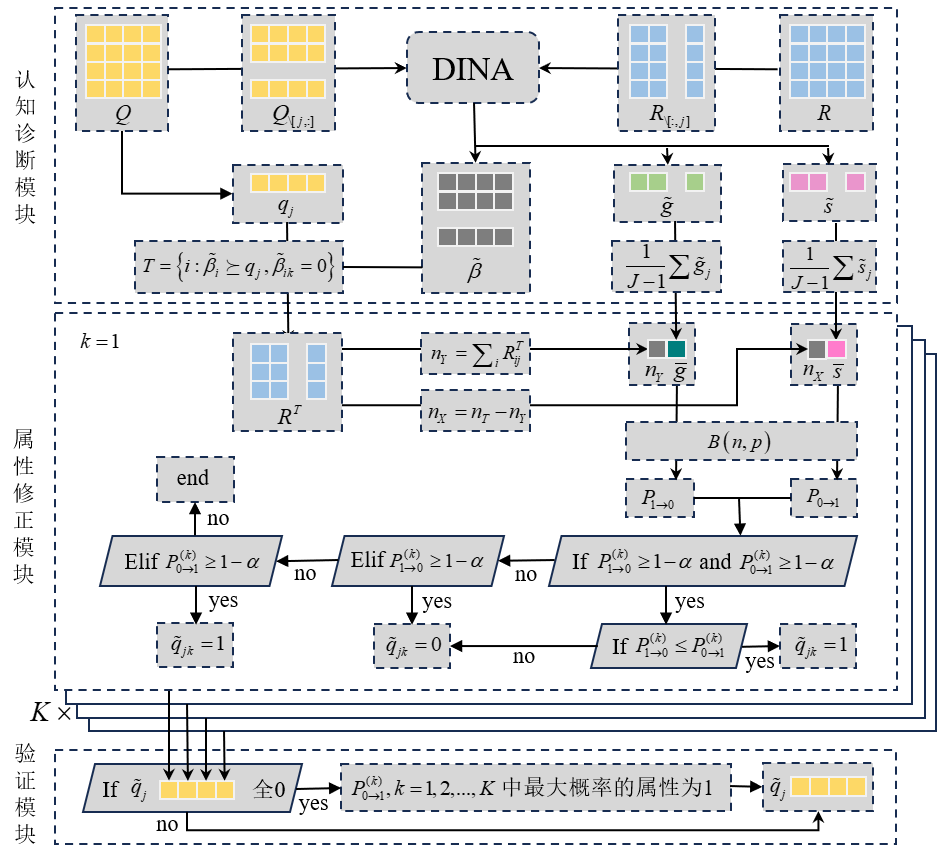

# CDM
本项目编写了认知诊断模型的相关代码，包括数据生成、DINA等认知诊断模型、Q矩阵修正算法等。

## 一、数据生成
- Q矩阵真值
  - 例如生成三道考察五个知识点的$Q$矩阵如$Q$，规则：题目考察的模式共有$2^5-1=31$种，而考察一个属性的不同模式共$5$种，占比为$5/31$。如果需要生成$62$道题目，则按比例生成考察一个属性的模式的数量为$5/31*62=10$道。其中着$10$道考察一个属性到底是哪个属性，则按均匀分布生成
  - $Q = \begin{bmatrix} 1 & 0 & 0 & 1 & 0 \\ 0 & 1 & 0 & 1 & 0 \\ 0 & 0 & 1 & 0 & 1 \end{bmatrix}$
- 错误的Q矩阵 
  - 在正确Q矩阵基础上，按照一定比例$p$随机改变其中的值，生成错误的Q矩阵，例如：
  - $Q = \begin{bmatrix} 1 & 1 & 0 & 1 & 0 \\ 0 & 1 & 0 & 1 & 0 \\ 0 & 0 & 1 & 0 & 1 \end{bmatrix}$
- 根据一定规则抽样学生掌握模式
  - 学生的掌握模式共有$2^k$种，$k$为知识点个数，例如五个知识点的掌握模式有$2^5=32$种，其中一种为$[0,0,1,1,0]$，表示学生掌握了第三和第四个知识点。
  - 生成学生掌握模式的方法有三种：
    - 第一种：和$Q$矩阵生成类似，按掌握属性个数所占的比例分配生成的学生数
    - 第二种：每种掌握模式均匀生成
    - 第三种：根据正态分布生成，例如：
      - $\mu = 2$ 、$$\sigma = 1$$
      - 生成的学生掌握模式为：以掌握2个知识点为均值，1个知识点为标准差的正态分布生成掌握模式，如下，因为是均值为2，所以大多数是掌握情况都是掌握2个知识点
      - 如$attribute = \begin{bmatrix} 1 & 1 & 0 & 1 & 0 \\ 0 & 1 & 0 & 1 & 0 \\ 0 & 0 & 1 & 0 & 1 \end{bmatrix}$
- 根据掌握模式生成$R$作答矩阵
  - 跟矩阵$Q$和学生掌握模式$attribute$，生成学生的作答矩阵$R$，例如：
  - Q矩阵：$Q = \begin{bmatrix} 1 & 0 & 0 & 1 & 0 \\ 0 & 1 & 0 & 1 & 0 \\ 0 & 0 & 1 & 0 & 1 \end{bmatrix}$
  - 学生掌握模式：$attribute = \begin{bmatrix} 1 & 1 & 0 & 1 & 0 \\ 0 & 1 & 0 & 1 & 0 \\ 0 & 0 & 1 & 0 & 1 \end{bmatrix}$
  - 作答矩阵：$R = \begin{bmatrix} 1 & 1 & 0 \\ 0 & 1 & 0 \\ 0 & 0 & 1 \end{bmatrix}$
- 生成错误的作答矩阵$R$
  - 生成学生作答矩阵的时候，根据错误的比例$p$，修改作答矩阵，例如Q矩阵错误率为$1/9$，则随机修正到(1,3)元素，将0改为1：
  - $R = \begin{bmatrix} 1 & 1 & 1 \\ 0 & 1 & 0 \\ 0 & 0 & 1 \end{bmatrix}$

## 二、认知诊断模型DINA

本项目修改Q矩阵是基于DINA模型估计参数，并进行下一步的修改Q矩阵算法

使用中科大的软件包EduCDM，由于部分代码进行过修改，所以将修改过的EduCDM代码放入本仓库。
### example:运行文件为cdm_test.py

```python
# ============ 导入必要的包  ==========================================
import numpy as np
from codes.EduCDM import EMDINA as DINA

# ========  加减法数据进行认知诊断  ====================================
# 数据准备
# Q矩阵
q_m = np.loadtxt("../data/math2015/FrcSub/q_m.csv", dtype=int, delimiter=',')
# 题目数、属性数
prob_num, know_num = q_m.shape[0], q_m.shape[1]
# 作答R矩阵
R = np.array(np.loadtxt("../data/math2015/FrcSub/data.csv", dtype=int, delimiter=','))
stu_num = R.shape[0]  # 学生数
# cdm估计参数
cdm = DINA(R, q_m, stu_num, prob_num, know_num, skip_value=-1)
cdm.train(epoch=2, epsilon=1e-3)
# 题目的guess、slip参数
guess = cdm.guess
slip = cdm.slip

```

## 三、Q矩阵修改模型

本项目为认知诊断Q矩阵修正算法复现 Q矩阵修正算法：delta法，gamma法
- delta法（已完成）
- gamma法（已完成）
- R法(待完成)
- 假设检验方法(待完成)

### $\delta$法修正

测试例子在example中，delta法输入参数有

- Q矩阵
- R作答矩阵
- 学生数
- 题目数
- 知识点数
- delta法中的$\epsilon0.01$


### $\gamma$法修正


gamma法的输入参数有

- Q矩阵
- R作答矩阵
- 学生数
- 题目数
- 知识点数
- gamma法中的guess参数阈值（论文设为0.2）
- gamma法中的slip参数阈值（论文设为0.2）
- gamma法中的ES阈值（论文设为0.2）

### 基于样本选择的假设检验法(SHT)

思路如下：本研究在DINA模型参数$gs$以及掌握状态$\beta$的基础上，结合2.2.2的样本选择机制和2.2.3假设检验理论，提出了$Q$矩阵的修正方法——基于样本筛选机制的假设检验法(SHT)。该方法基于两种基本的假设检验情形，对$Q$矩阵元素逐题修正，并进行逐题验证，完整的$Q$矩阵SHT法修正算法步骤见伪代码1。

算法具体分为三个模块：(1)认知诊断参数估计模块，(2)属性修正模块和(3)验证模块。认知诊断模块用于估计参数，例如伪代码2-4行对$g,s,\beta$分别估计；属性修正模块是对题目$j$所有属性分别修正，如伪代码7-20行，其中，检验的属性可能同时拒绝缺失假设和冗余假设，因此需要取“更有可能”的情况；最后，鉴于$q$向量可能修正为0向量，但题目至少考察一个属性，因此需要验证模块，取$K$个属性中取缺失概率最大的属性进行考察。




## 四、代码使用教程

- 主程序 main1_tuning_para.py 为研究一(1):假设检验方法中置信度选择及其可行性和准确性（调参代码）即与其他算法对比，在对比中调整参数，观察结果，最后确定参数范围，然后进行不同参数下的只有SHT算法本身的实验
- 主程序main1 为研究一(2):假设检验方法中置信度选择及其可行性和准确性，即假设检验SHT方法自身的测试和调参
- 主程序main2 研究二：SHT算法与其他算法的比较函数。
- 主程序main3 研究三：SHT算法在实证数据上与其他算法比较